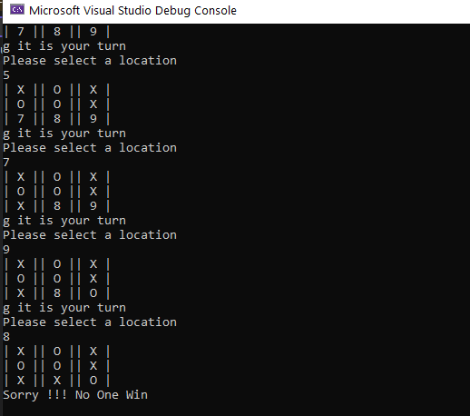

# Lab4-Classes-Objects-tic-tac-toe-
## Problem Domain

Create a two (2) person,Tic-Tac-Toe program which takes turns between the two players in order to play the game. Prompts to enter two user names. The game will begin with player one (assigned X) choosing a number on the game board. Next, player two (assigned O) will choose an available number on the board. Continue until there is a winner or until there is a draw.
## Getting Started
Clone this repository to your local machine.

$ git clone https://github.com/Hanan-Nathem-Saadeh/Lab4-tic-tac-toe.git

**To run the program from Visual Studio:**
- Select File -> Open -> Project/Solution

- Next navigate to the location you cloned the Repository.

- Double click on the Lab04_TicTacToe.

- Then select and open .sln file.
--- 
## Visuals
 ### The Game 
 
 ### Win Case 
  
### Lose Case 
 
 ### Tests
  

  

